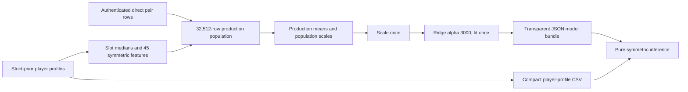

# Pair Fit v2 owner guide

## What the model predicts

Pair Fit v2 predicts **shared-court team NET_RATING**: the team's expected points-per-100-possessions margin while two selected player versions are on the court together. A result of `+4` means roughly four more points scored than allowed per 100 possessions in that shared-court context; `-4` means roughly four fewer.

This is not a chemistry meter, player-quality grade, probability, win total, or promise. It summarizes a statistical relationship in historical lineup evidence. Teammates, opponents, coaching, roles, injuries, and exact lineup circumstances still matter.

## How one training row is made

One row represents one unordered player pair on one team in one target season. It enters training only when the direct full-season lineup source reports at least 150 shared possessions. Its target is that row's direct team NET_RATING. Each player's predictors come only from the nearest available season strictly before the target, up to three seasons back. Target-season player statistics, recovered windows, reconstructed targets, old predictions, pair minutes, and pair possessions never become model features.

The production population contains 32,512 unique rows: 29,701 from `2014-15`–`2024-25` and 2,811 from `2025-26`. The previously protected final test is now spent evidence and appropriately joins final deployment training.

## What the 45 features mean

The inputs are symmetric, so the pair has no first or second player.

- **22 pair averages:** average age, scoring-volume counts, shooting-volume counts, rebounding, passing, turnovers, defense, fouls, plus/minus, and four derived shooting rates.
- **22 absolute differences:** how far apart the two players are on those same measures, without assigning direction or order.
- **1 traded-history count:** how many of the two prior-season profiles indicate multiple teams, from zero to two.

Shot-zone features, pair target/exposure fields, team identity, and player reliability metadata (`GP`, `TOTAL_MIN`) are not estimator inputs. `GP` and `TOTAL_MIN` remain in the profile bundle only to describe source reliability.

## History and missingness

For target season `2026-27`, lookup checks `2025-26`, then `2024-25`, then `2023-24`. It never looks at `2026-27`. Missingness is recorded before imputation. The same production-learned median is used for either slot, preserving symmetry.

Confidence is `standard` when both histories are found and `lower` when either or both are missing. It says only how complete the history lookup was; it is not a probability or accuracy percentage.

## Why Ridge

Ridge is a linear regression with a penalty that discourages unstable, oversized coefficients when predictors overlap. Basketball box-score measures are strongly related to one another, so the penalty makes the model more stable. The frozen development process selected `alpha=3000.0`; production packaging did not reopen that decision or compare alternatives.

The tradeoff is compression: extreme predictions are pulled toward the overall average. This is visible in the final test, where prediction spread was much smaller than target spread. Compression can improve typical error while understating genuinely extreme contexts.

## Reading model metrics

- **MAE** is the average absolute miss. Final-test MAE was about 7.8 NET_RATING points.
- **RMSE** also measures error but penalizes large misses more. Final-test RMSE was about 9.95.
- **R²** is the share of variation explained relative to predicting the mean. Final-test R² was about 0.10, a modest share.
- **Bias** is the signed average error. Near zero means over- and under-predictions broadly offset; final-test bias was about +0.36.
- **Spearman** measures whether higher predictions generally correspond to higher actual outcomes by rank. Final-test Spearman was about 0.34.
- **Dispersion** compares the spread of predictions with outcomes. Narrower prediction spread is evidence of compression.

“Typical final-test error: approximately 7.8 points per 100 possessions” describes observed MAE. It must not be presented as a calibrated ±7.8 interval.

## Development versus final test

The `2024-25` season was the development holdout used to choose and freeze the model contract. The `2025-26` season was the final test and was held back until one authorized evaluation. `FINAL SCIENTIFIC PASS` means the frozen Ridge improved on its predeclared historical-mean baseline for both required error gates and cleared integrity checks.

The pass does not prove causality, individual-player value, universal accuracy, calibrated uncertainty, or success in every subgroup. It does not remove context the features cannot observe. After that evaluation, `2025-26` became spent evidence and was included in the one final production training population; no new training-fit score was used as another verdict.

## Supported seasons and display

Target seasons `2014-15` through `2026-27` are supported. Both cards must use the same target season and different player IDs. Earlier, later, cross-season, and cross-era requests are refused. The interface returns full precision, while the headline rounds to a whole point and shows an explicit plus sign for positive values.

## Annual update procedure

1. Acquire and authenticate the new direct full-season pair sources and new prior-season Per100/Totals player profiles.
2. Reconcile identities, schemas, exclusions, unique keys, direct targets, and `POSS >= 150` eligibility.
3. Extend the compact profile bundle by one authenticated season.
4. Relearn slot medians, symmetric fills, means, and population scales from all eligible production rows.
5. Scale once and fit the unchanged Ridge once unless a separately authorized research phase changes the model contract.
6. Serialize transparent coefficients and preprocessing, prove packaged/sklearn parity and swap invariance, run deterministic builds, update hashes and documentation, then perform a focused read-only audit.

Do not enable `2027-28` until authenticated `2026-27` individual profiles exist.

## Operational files

- `production/pair-fit-v2.0.0/model.json`: transparent coefficients, intercept, preprocessing, support rules, and evidence hashes.
- `production/pair-fit-v2.0.0/player_profiles.csv`: load-once compact player-season lookup table.
- `production/pair-fit-v2.0.0/artifact_manifest.json`: nonrecursive byte counts and SHA-256 hashes.
- `production/pair-fit-v2.0.0/metadata.json`: population, acquisition, preprocessing, parity, and fit diagnostics.
- `src/pair_fit_v2/inference.py`: pure no-sklearn inference.
- `src/pair_fit_v2/phase4a_production.py`: authenticated acquisition and deterministic package builder.
- `tests/test_phase4a_production.py`: focused product and packaging contract tests.

## Glossary

- **NET_RATING:** points scored minus points allowed per 100 possessions.
- **Target season:** the season being projected.
- **Source profile:** a player's authenticated individual statistics from an earlier season.
- **Strict prior:** the source season must begin before the target season.
- **Lookback:** how many seasons earlier the selected profile is; maximum three.
- **Imputation:** replacing a missing numeric input with a frozen production median.
- **Symmetric feature:** a value unchanged when the two players swap positions.
- **Scaling:** subtracting the production mean and dividing by the production population standard deviation.
- **Coefficient:** the Ridge weight applied to one scaled feature.
- **Intercept:** the model's constant term.
- **Holdout/final test:** evidence not used during model development, opened once for the predeclared final evaluation.
- **Compression:** predictions having less spread than observed outcomes because regularization pulls estimates toward average.
